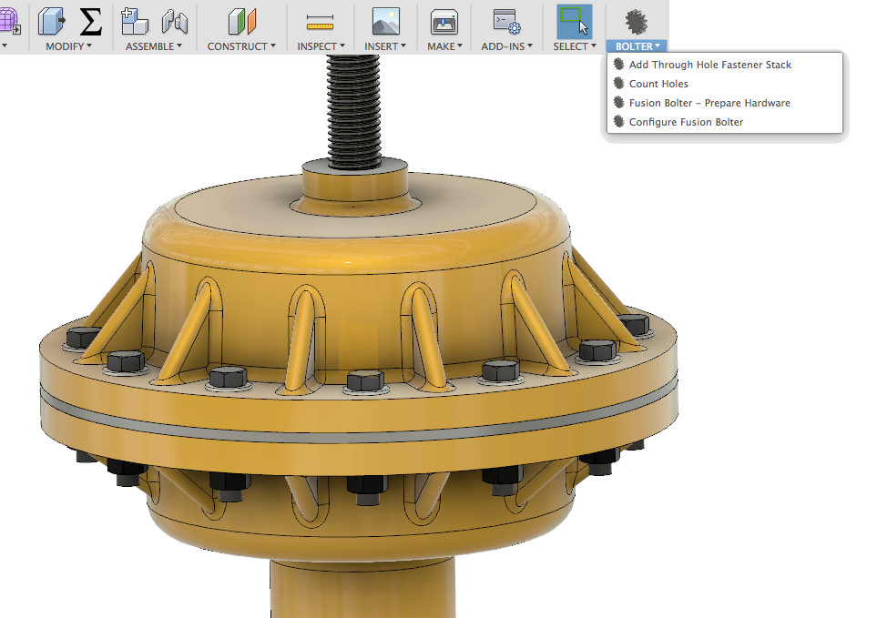

# FusionBolter

A Fusion 360 Addin to create and manage bolted connections and hardware

This sample is provided "As-is" with no guarantee of performance, reliability or warranty.

# Installation
[Click here to download the Add-in](https://github.com/tapnair/FusionBolter/archive/master.zip)

After downloading the zip file follow the [installation instructions here](https://tapnair.github.io/installation.html) for your particular OS version of Fusion 360

# Usage
Instructions Coming Soon

See a video here: https://youtu.be/k9R1rYNuVgw

## License
Samples are licensed under the terms of the [MIT License](http://opensource.org/licenses/MIT). Please see the [LICENSE](LICENSE) file for full details.

## Written by

Written by [Patrick Rainsberry](https://twitter.com/prrainsberry)   (Autodesk Fusion 360 Business Development)

See more useful [Fusion 360 Utilities](https://tapnair.github.io/index.html)

